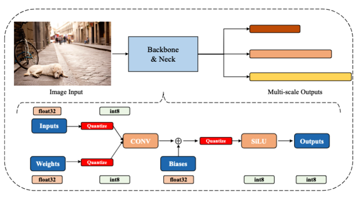
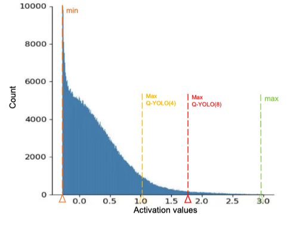
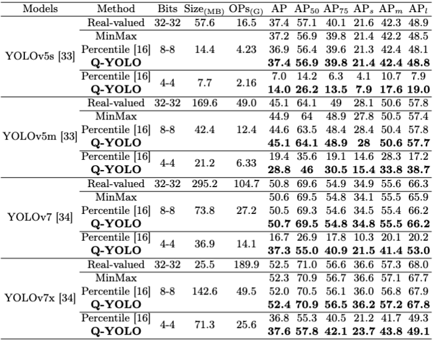
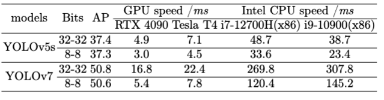

# **Q-YOLO: Efficient Inference for Real-time Object Detection**
This is the official implementation of the arxiv paper "Q-YOLO: Efficient Inference for Real-time Object Detection". [arxiv](http://arxiv.org/abs/2307.04816)


## ***<font color="red">Tips!!!</font>***

We apologize for any inconvenience caused, but due to certain business reasons, we are temporarily unable to release the code. However, if you have any related questions, you are free to contact the email: wmz20000729@buaa.edu.cn

## ***Introduction***
Q-YOLO is a quantization solution specially designed for the YOLO series. We utilize the PTQ quantization approach and provide a code library that allows for easy export of ONNX models for subsequent deployment.

**Abstract**: Real-time object detection plays a vital role in various computer vision applications. However, deploying real-time object detectors on resource-constrained platforms poses challenges due to high computational and memory requirements. This paper describes a low-bit quantization method to build  a highly efficient one-stage detector, dubbed as  Q-YOLO, which can effectively address the performance degradation problem caused by activation distribution imbalance in traditional quantized YOLO models. Q-YOLO introduces a fully end-to-end Post-Training Quantization (PTQ) pipeline with a well-designed Unilateral Histogram-based (UH) activation quantization scheme, which determines the maximum truncation values through histogram analysis by minimizing the Mean Squared Error (MSE) quantization errors. Extensive experiments on the COCO dataset demonstrate the effectiveness of Q-YOLO, outperforming other PTQ methods while achieving a more favorable balance between accuracy and computational cost. This research contributes to advancing the efficient deployment of object detection models on resource-limited edge devices, enabling real-time detection with reduced computational and memory overhead.

<div align="center">
  <a href="./pictures/fig2.png">
    
  </a>
</div>


## ***Notice***
A Unilateral Histogram-based (UH) activation quantization method is proposed to leverage histogram analysis to find the maximum truncation values, which can effectively minimize the MSE quantization error.
<div align="center">
  <a href="./pictures/fig1.png">
    
  </a>
</div>

Here we have only provided the code for ***YOLOv5***, but Q-YOLO can be easily integrated into any YOLO project.


## ***Installation and Get Started***

Note that this repository is based on the [Yolov5-6.2](https://github.com/ultralytics/yolov5/tree/v6.2). Please follow the following steps for installation.

```shell script
git clone https://github.com/Meize0729/Q-YOLO.git
cd Q-YOLO
pip install -r requirements.txt
```

## ***How to use Q-YOLO***
Firstly, you should modify the dataset path in [coco.yaml](./data/coco.yaml) under the "data" directory to the path where you have saved the dataset.

If you want to implemente basic quantization methods such as MinMax, Optimized Mean Squared Error (oMSE), and Percentile on YOLOv5, You may use this. Please refer to the code for detailed explanation. This module was modified based on [FQVIT](https://github.com/megvii-research/FQ-ViT).
```shell script
python base_quant.py --weights='./yolov5s.pt' --method 'percentile' --flag=True --num_bits=8 --data='./data/coco.yaml' --device='cuda:0'
```

The most important part! If you want to use ***Q-YOLO***, you can run:
```shell script
cd ptq_main
python ptq_main.py --weights='./yolov5s.pt' --input_calib='histogram' --method ='mse' --flag=True --flag=False --num_bits=8 --data='./data/coco.yaml' --device='cuda:0'
```
--weights: The FP32 model path; --input_calib: Data collection mode('histogram' or 'minmax');  --method: The method to find the truncation threshold('mse' or 'percentile'). Please refer to the code for detailed explanation. This module was modified based on [TensorRT](https://github.com/NVIDIA/TensorRT/tree/release/8.6/tools/pytorch-quantization).

Furthermore, if you have generated a Q-YOLO model, you can run following codes to test accuracy:
```shell script
cd ptq_main
python ptq_main.py --weights_ptq='your .pt path'
```
***
## ***Main Results***

**Table 1**: A comparison of various quantization methods applied to YOLOv5s, YOLOv5m, YOLOv7 and YOLOv7x, which have an increasing number of parameters, on the COCO dataset. The term Bits (W-A) represents the bit-width of weights and activations. The best results are displayed in bold.
<div align="center">
  <a href="./pictures/fig3.png">
    
  </a>
</div>

**Table 2**: The inference speed of the quantized model is essential. The quantization scheme adopts uniform quantization, with single-image inference mode and an image size of 640*640. TensorRT is selected as the GPU inference library, while OpenVINO is chosen for the CPU inference library.
<div align="center">
  <a href="./pictures/fig4.png">
    
  </a>
</div>


I especially want to thank the previous work of [FQVIT](https://github.com/megvii-research/FQ-ViT) and [TensorRT](https://github.com/NVIDIA/TensorRT/tree/release/8.6/tools/pytorch-quantization), as my own work may seem somewhat inadequate. I hope for your understanding and forgiveness.# Q-YOLO
